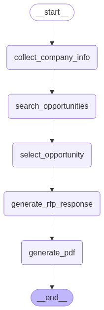

# RFP Assistant – Canadian Tender AI

A real-time, production-grade RFP Assistant that helps companies discover, evaluate, and respond to Canadian procurement opportunities.

### 🔍 Features

- ✅ Scrapes opportunities from:
  - [Ariba Discovery](https://portal.us.bn.cloud.ariba.com/discovery/public/leads/search)
  - [Alberta Purchasing Connection](https://purchasing.alberta.ca/search)
  - add more...

- 🧠 Search & Analyzes opportunity fit 
- 📝 Generates RFP drafts: cover letter, executive summary, capabilities mapping
- ⚡ Streamlit AI chat for seamless user experience
- 🔁 Real-time orchestration

---

## 🏗️ High-level Architecture Overview

## 🏗️ Low-level Architecture Overview (with Watsonx Orchestrate)

---

## 🛠️ Project Setup

### Prerequisites
- Python3.11+
- [requirements file](./requirements.txt)

### Run
1. `python rfp_assistant.py` - to start the backend app
2. `python rfp_assistant_frontend.py` - to start the frontend app

### LangGraph Experimentations
- [Experimentations](./experimentations)
